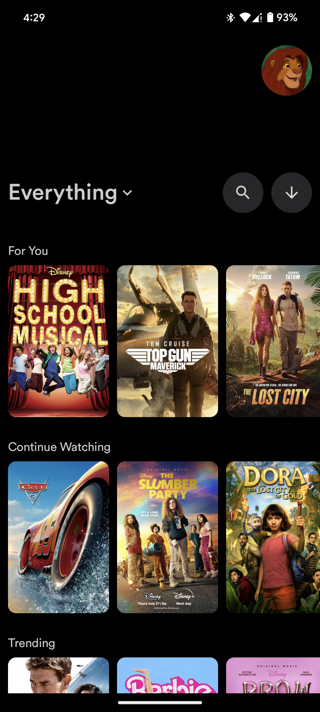
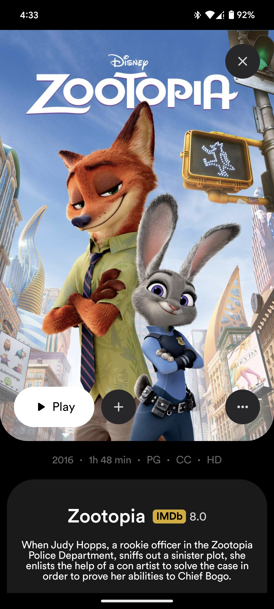
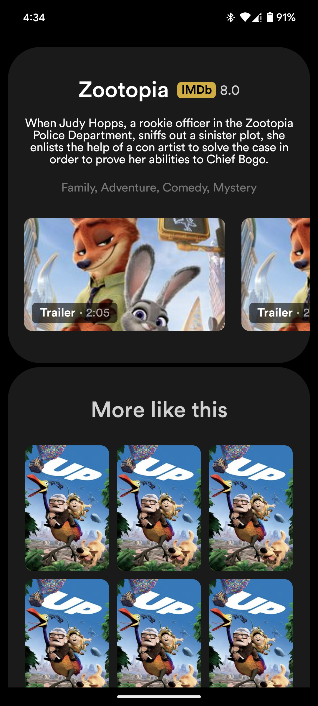

# Disney+ Hotstar Replica

This project is a work-in-progress replica of the Disney+ Hotstar app, focusing on displaying
movies. The UI design is heavily inspired
by [Disney But Better](https://www.behance.net/gallery/141700011/Disney-But-Better) on Behance. It
is built using Jetpack Compose, the modern UI toolkit for building native Android apps.

## Screenshots

## Installation

- Clone the repository: git clone https://github.com/MansuriYamin/DisneyHotstar.git
- Open the project in Android Studio.
- Build and run the project on an Android emulator or physical device.

## Usage

- Upon launching the app, you'll be presented with a list of movies.
- Scroll through the list to browse available titles.
- Tap on a movie to view its details.
- On the movie details screen, you can see additional information such as genre, trailers, and
  ratings.
- Enjoy a sneak peek of what's to come as we continue development!

## Contributions

Contributions are welcome! If you'd like to contribute to this project, please follow these steps:

- Fork the repository.
- Create a new branch (`git checkout -b feature/new-feature`).
- Make your changes and commit them (`git commit -am 'Add new feature'`).
- Push to the branch (`git push origin feature/new-feature`).
- Create a new pull request.

## Acknowledgements

- Thanks to Disney for the inspiration from their Hotstar app.
- Special thanks to the Jetpack Compose team for creating such a powerful UI toolkit.
- UI design heavily inspired
  by [Disney But Better](https://www.behance.net/gallery/141700011/Disney-But-Better) on Behance.
